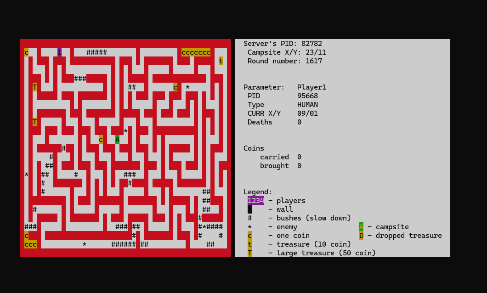

# Server Application for a Simple Board Game

This is a server application for a simple board game written in C, compatible with Linux systems. It utilizes multi-threading and thread synchronization mechanisms, as well as shared memory for inter-process communication. The server allows up to four independent players to play the game concurrently as separate processes. Each player communicates with the server via shared memory. The server's role is to manage the game logic and control the actions of wild beasts, each running in its own thread.

## Game Rules

Players (1, 2, 3, 4) are located in a maze and must collect treasure in the form of coins (represented by `c`, `t`, `T`). To win, a player needs to collect enough coins and deliver them to a campsite (`A`), where they will be recorded. Players can carry any number of coins (`carried`), but there is a risk of losing the treasures due to a wild beast attack (`*`) or collision with other players.

- **Wild Beast Attack:** The player dies (`deaths`), and their treasures remain at the death location (`D`). The player respawns at their starting point after death.
- **Collision with Another Player:** Both players' treasures are left at the collision site (`D`), and they respawn at their starting points. The value of the left loot is the sum of the coins carried by both players.
- **Campsite (`A`):** Players drop their collected treasures at the campsite, and the coins are added to their budget (`budget`). After delivering the treasures, the player resumes searching, starting from the campsite.


## Player Types

- **Bot (CPU):** An AI-controlled player that moves autonomously based on the map provided by the server.
- **Human (HUMAN):** A human-controlled player that uses arrow keys (up, down, left, right) to move.

## How to Run the Application

To run the application, follow these steps:

1. Configure the environment using CMake:
   ```bash
   cmake ..
   ```

2. Build the application:
   ```bash
   make
   ```

3. Run the server:
   ```bash
   ./server
   ```
